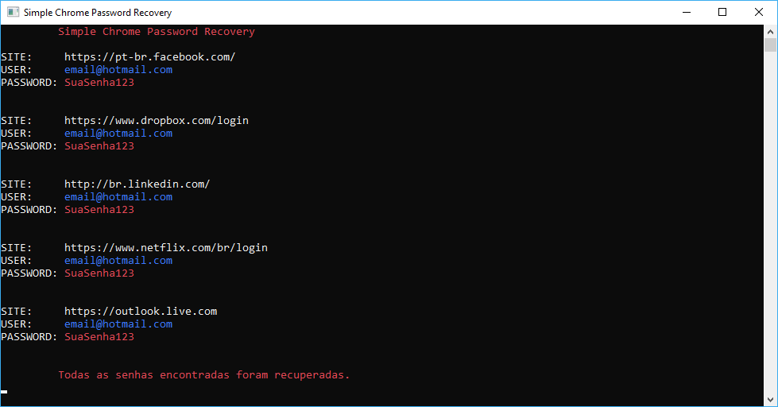

# Simple-Chrome-Password-Recovery

Simples aplicação para recuperar senhas salvas no navegardor Google Chrome armazenadas localmente e em cookies.
Não há DDLs externas para utlização do SQLite, tudo é feito atráves da classe SQLiteHandler.

Observação: Eu não sou responsável por nada que você faça com isso. Isso é apenas para propósitos educacionais.
